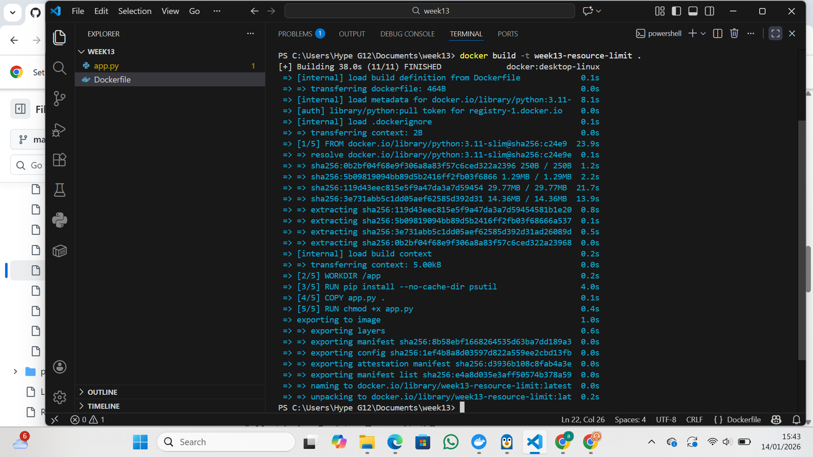
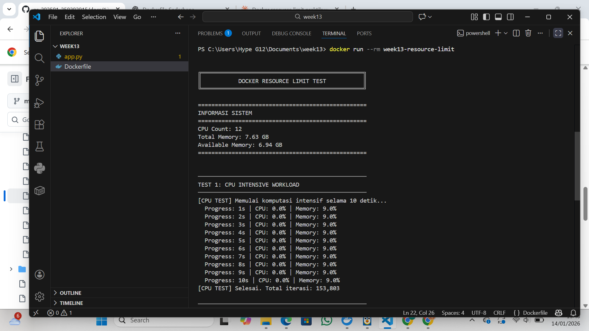
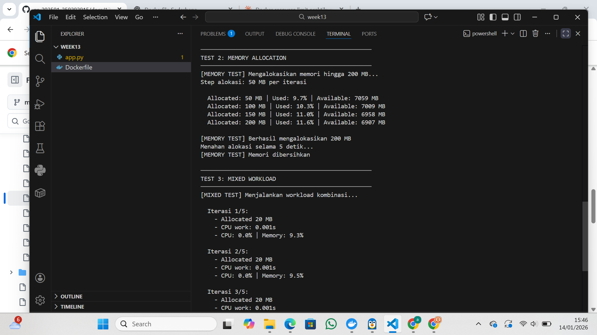
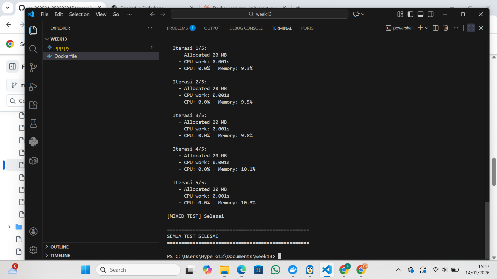
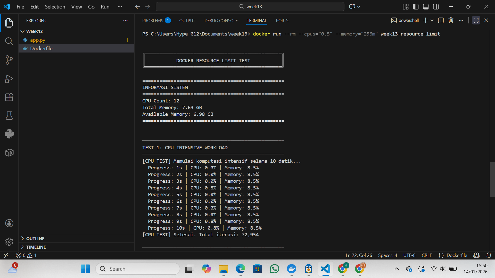
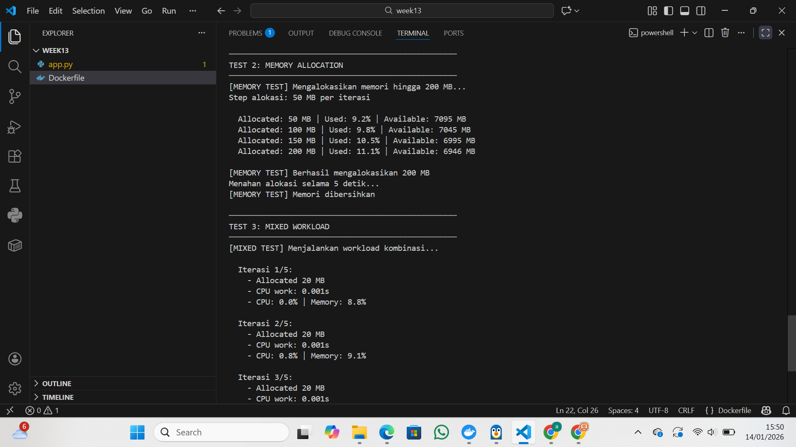
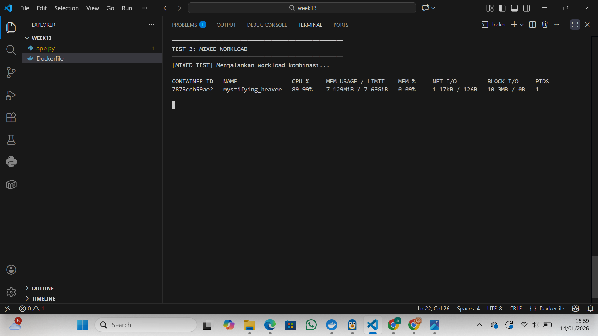

# Laporan Praktikum Minggu 13
Topik: Docker – Resource Limit (CPU & Memori)

---

## Identitas
- **Nama**  : Aster Rifani
- **NIM**   : 250202915 
- **Kelas** : 1IKRB

---

## Tujuan 
> Menulis Dockerfile sederhana untuk sebuah aplikasi/skrip.

> Membangun image dan menjalankan container.

> Menjalankan container dengan pembatasan CPU dan memori.

> Mengamati dan menjelaskan perbedaan eksekusi container dengan dan tanpa limit resource.

> Menyusun laporan praktikum secara runtut dan sistematis.

---

## Dasar Teori
Container adalah unit standar software yang mengemas kode dan semua dependensinya sehingga aplikasi dapat berjalan dengan cepat dan handal dari satu computing environment ke environmeny lainnya.

Docker menggunakan cgroups(control groups) dari linux kernel untuk membatasi,mengatur,dan mengisolasi penggunaan resource seperti CPU,memori,disk I/O,dan network.

---

## Langkah Praktikum
1. **Persiapan Lingkungan**

   - Pastikan Docker terpasang dan berjalan.
   - Verifikasi:
     ```bash
     docker version
     docker ps
     ```

2. **Membuat Aplikasi/Skrip Uji**

   Buat program sederhana di folder `code/` (bahasa bebas) yang:
   - Melakukan komputasi berulang (untuk mengamati limit CPU), dan/atau
   - Mengalokasikan memori bertahap (untuk mengamati limit memori).

3. **Membuat Dockerfile**

   - Tulis `Dockerfile` untuk menjalankan program uji.
   - Build image:
     ```bash
     docker build -t week13-resource-limit .
     ```

4. **Menjalankan Container Tanpa Limit**

   - Jalankan container normal:
     ```bash
     docker run --rm week13-resource-limit
     ```
   - Catat output/hasil pengamatan.

5. **Menjalankan Container Dengan Limit Resource**

   Jalankan container dengan batasan resource (contoh):
   ```bash
   docker run --rm --cpus="0.5" --memory="256m" week13-resource-limit
   ```
   Catat perubahan perilaku program (mis. lebih lambat, error saat memori tidak cukup, dll.).

6. **Monitoring Sederhana**

   - Jalankan container (tanpa `--rm` jika perlu) dan amati penggunaan resource:
     ```bash
     docker stats
     ```
   - Ambil screenshot output eksekusi dan/atau `docker stats`.

7. **Commit & Push**

   ```bash
   git add .
   git commit -m "Minggu 13 - Docker Resource Limit"
   git push origin main
   ```

---

## Kode / Perintah
```
docker version
docker ps
```
```
docker build -t week13-resource-limit .
```
```
docker run --rm week13-resource-limit
```
```
docker run --rm --cpus="0.5" --memory="256m" week13-resource-limit
```
```
docker stats
```

---

## Hasil Eksekusi
1. Membuat Dockerfile :

2. Menjalankan Container Tanpa Limit




2. Menjalankan Container Dengan Limit Resource




3. Monitoring Sederhana :

---

## Analisis
Pengujian menunjukkan bahwa container yang dijalankan tanpa batasan resource dapat menggunakan CPU dan memori secara bebas sehingga program berjalan lebih cepat dan stabil. Namun, ketika container diberi limit CPU dan memori, waktu eksekusi program menjadi lebih lambat dan alokasi memori dapat terhenti atau menimbulkan error. Hal ini membuktikan bahwa Docker mampu mengontrol penggunaan resource secara efektif untuk mencegah satu container mengganggu kinerja sistem secara keseluruhan. 

---

## Kesimpulan
Dari hasil pengujian dapat disimpulkan bahwa pembatasan resource pada container Docker sangat penting untuk menjaga efisiensi dan stabilitas sistem. Dengan menerapkan limit CPU dan memori, administrator dapat mengontrol penggunaan resource tiap container, mencegah overload, serta memastikan beberapa aplikasi dapat berjalan secara bersamaan tanpa saling mengganggu.

---

## Quiz
1. Mengapa container perlu dibatasi CPU dan memori? 
   **Jawaban:**  Container perlu dibatasi CPU dan memori agar satu aplikasi tidak menggunakan seluruh resource sistem yang dapat mengganggu aplikasi lain. Pembatasan ini menjaga kestabilan sistem, meningkatkan efisiensi penggunaan resource, serta mencegah terjadinya overload atau crash pada host.
2. Apa perbedaan VM dan container dalam konteks isolasi resource?
   **Jawaban:**  Virtual Machine (VM) melakukan isolasi resource dengan menjalankan sistem operasi lengkap di atas hypervisor, sehingga penggunaan resource lebih besar. Sementara itu, container hanya mengisolasi aplikasi dan dependensinya dengan berbagi kernel host, sehingga lebih ringan, cepat dijalankan, dan penggunaan resource lebih efisien.
3. Apa dampak limit memori terhadap aplikasi yang boros memori?
   **Jawaban:**  Limit memori dapat menyebabkan aplikasi yang boros memori mengalami penurunan performa, error (seperti MemoryError), atau bahkan dihentikan secara paksa oleh Docker jika penggunaan memori melebihi batas. Namun, pembatasan ini mencegah aplikasi tersebut merusak stabilitas sistem secara keseluruhan.

---

## Refleksi Diri
Tuliskan secara singkat:
- Apa bagian yang paling menantang minggu ini?  
- Bagaimana cara Anda mengatasinya?  

---

**Credit:**  
_Template laporan praktikum Sistem Operasi (SO-202501) – Universitas Putra Bangsa_
